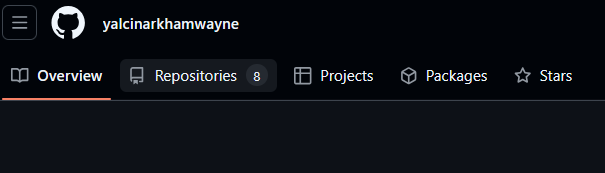
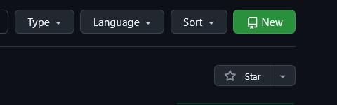
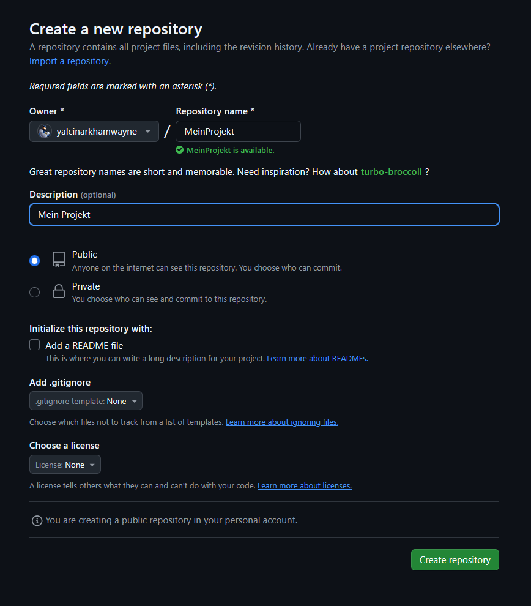
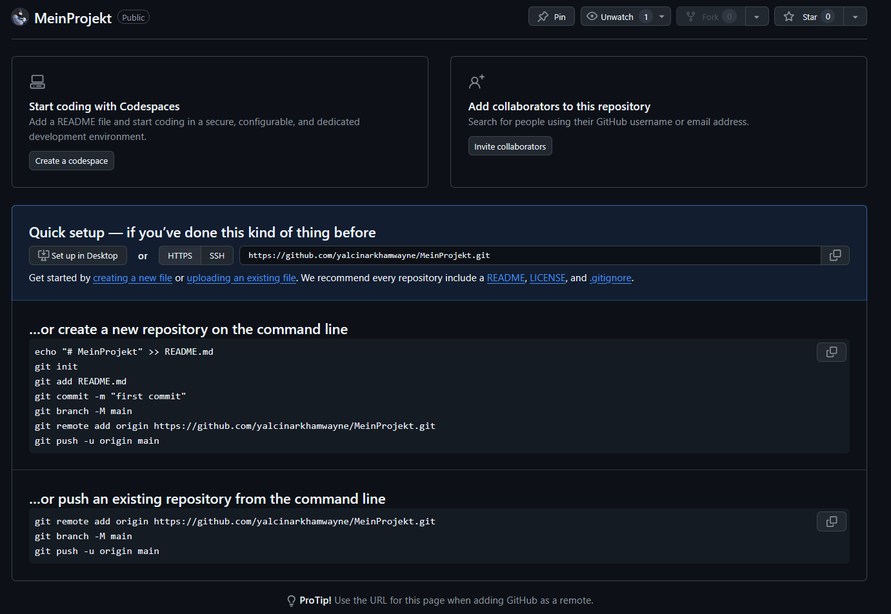
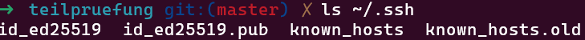

# Aufgabe: GitHub Repository Setup und Workflow

## Beginn der erwünschten Dokumentation
- Erstelle eine README-Datei im Wurzelverzeichnis deines lokalen Repositories.

- Dokumentiere in der README-Datei die folgenden Punkte:

- Die Schritte, die du zum Einrichten des GitHub-Repositorys "MeinProjekt" durchgeführt hast.

- Die Schritte, die du zum Erstellen eines SSH-Schlüssels (falls du keinen bereits hattest) durchgeführt hast.

Habe bereits einen Schlüssel:

- Die Schritte, die du zum lokalen Klonen des Repositorys, zum Konfigurieren von Git und zum Erstellen der initialen Commits durchgeführt hast.

1. 

- Die Schritte, die du zum Erstellen des "feature"-Branches, zum Hinzufügen einer neuen Datei zu diesem Branch und zum Committen der Änderungen durchgeführt hast.

- Die Schritte, die du zum Mergen des "feature"-Branches in den "master"-Branch und zum Beheben des dabei auftretenden Merge-Konflikts durchgeführt hast.

- Verwende Screenshots oder Code-Blöcke, um deine Erklärungen zu verdeutlichen.
